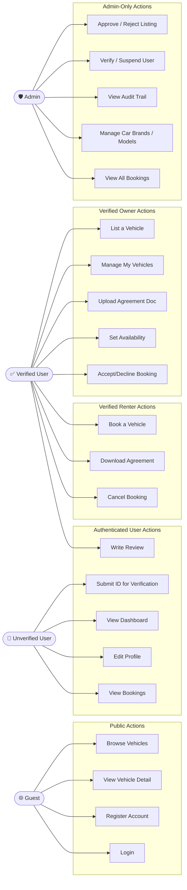
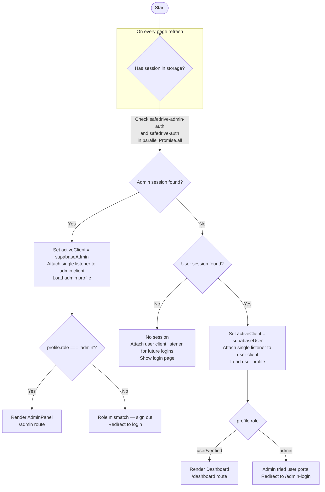
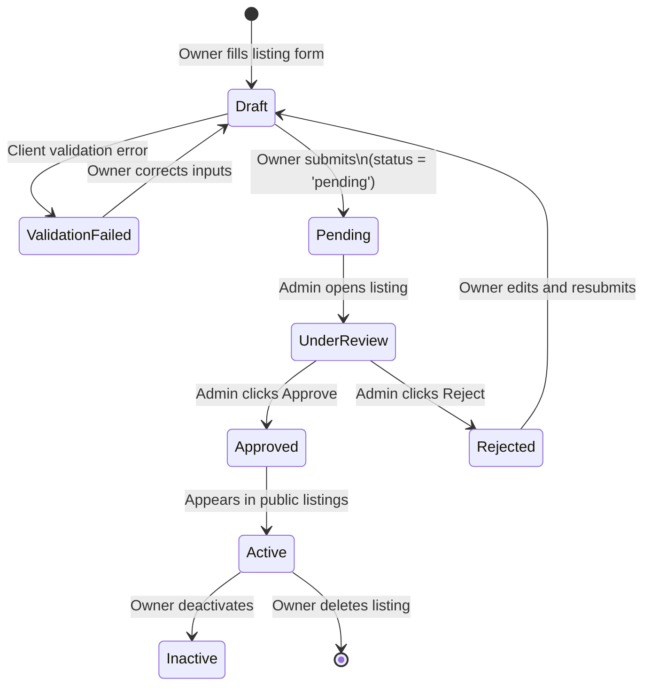
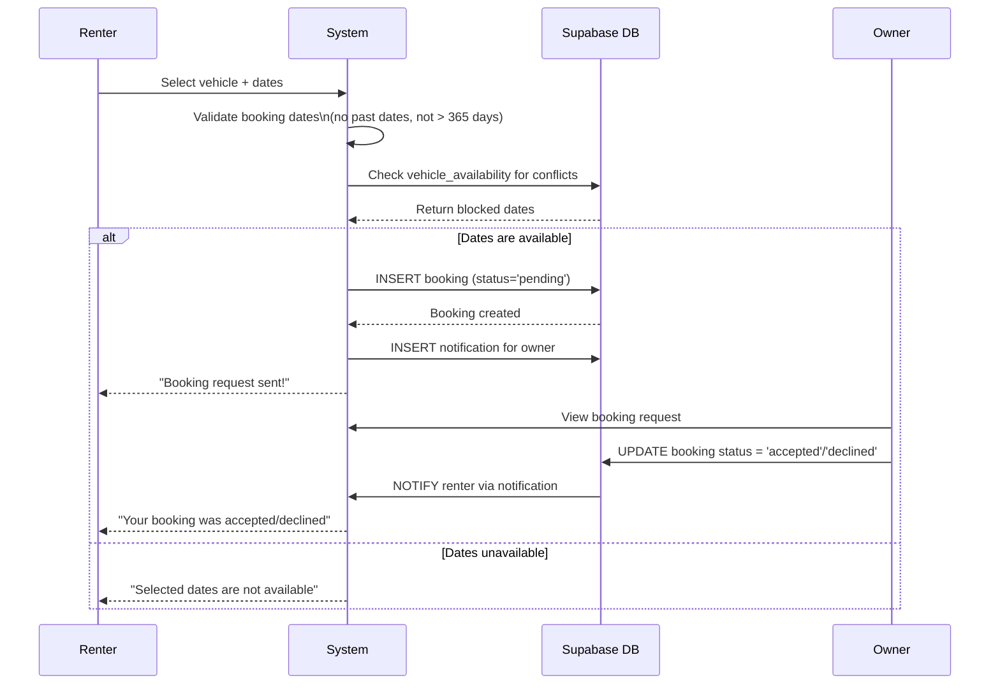
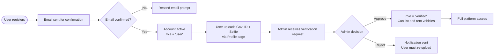
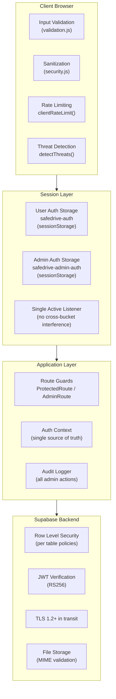
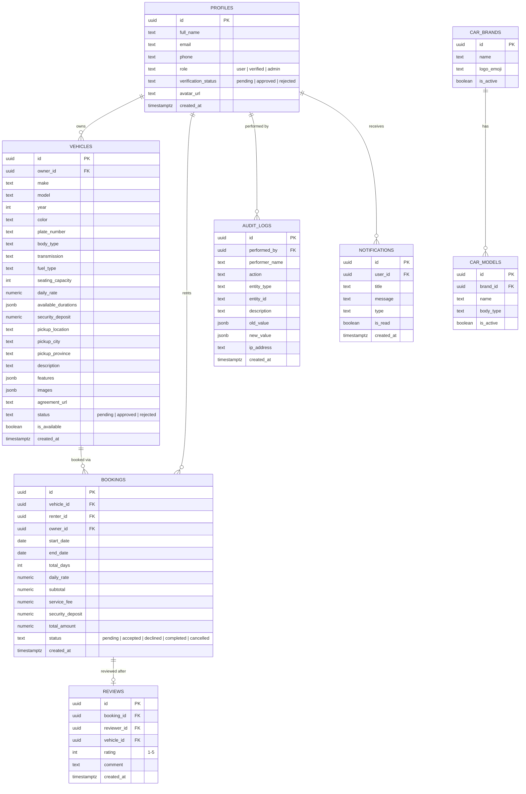
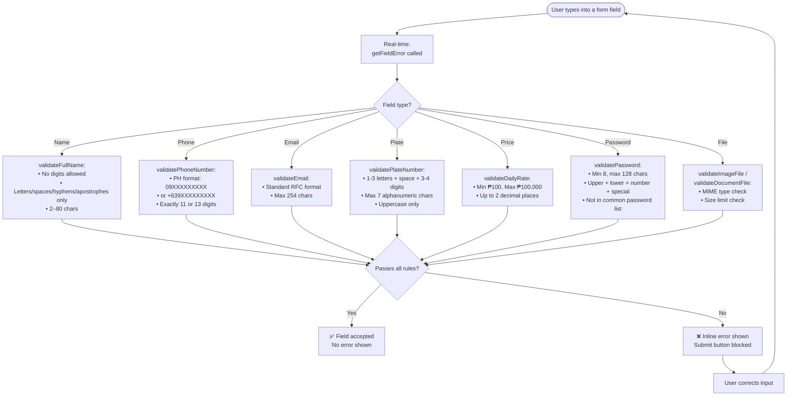
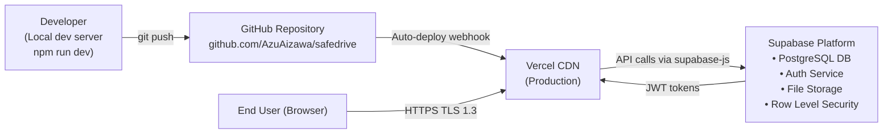

# SafeDrive — Complete System UML Diagram
**Version 3.0 · March 2026**

---

## 1. Actor Definitions

| Actor | Description |
|---|---|
| **Guest** | Unauthenticated visitor browsing the platform |
| **User (Unverified)** | Registered account, email confirmed, no ID submitted yet |
| **User (Verified)** | Account with approved government ID — can list and rent vehicles |
| **Admin** | Platform staff — can approve listings, manage users, view audit logs |

---

## 2. Use Case Diagram

---

## 3. Authentication Flow Diagram

---

## 4. Vehicle Listing Workflow (State Machine)

---

## 5. Booking Flow Diagram

---

## 6. User Verification Workflow

---

## 7. Security Architecture Diagram

---

## 8. Data Model (Entity Relationship)

---

## 9. Input Validation Decision Tree

---

## 10. Deployment Architecture

